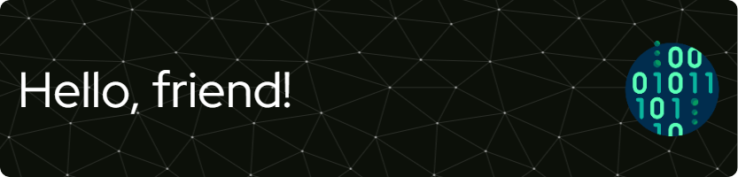

## :atom: About me:
My name is Nikita Savvinov and I'm chasing my dream! ✨

I built my career as an auditor and an IFRS specialist, but decided to do what I had been striving for since childhood to become an IT specialist.

Throughout my career as an economist, I have always implemented solutions that helped automate the workflow, so I came to the profession of a data engineer, and later began studying to the data scientist.

- 🌱 I'm currently taking a course on the Yandex Practicum platform
- 🌟 I'm studying the necessary tools for data science on stepik
- 🔭 I'm looking for job

## 🛎️ How to reach me:

## 🏆 Languages and Tools:
<code></code>
<code></code>
<code></code>

## ⚙️ GitHub Stats
 []

<!--
**Nikita-Savvinov/Nikita-Savvinov** is a ✨ _special_ ✨ repository because its `README.md` (this file) appears on your GitHub profile.

Here are some ideas to get you started:

- 🔭 I’m currently working on ...
- 🌱 I’m currently learning ...
- 👯 I’m looking to collaborate on ...
- 🤔 I’m looking for help with ...
- 💬 Ask me about ...
- 📫 How to reach me: ...
- 😄 Pronouns: ...
- ⚡ Fun fact: ...
-->
